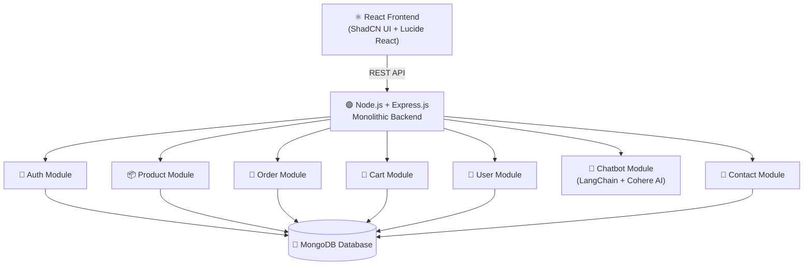
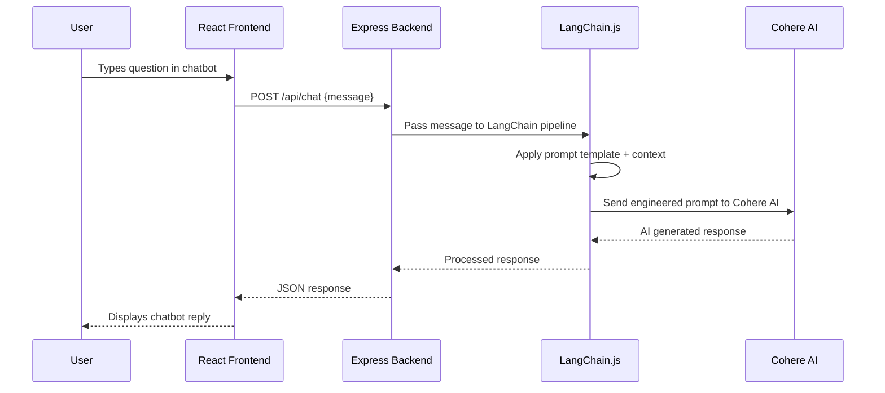
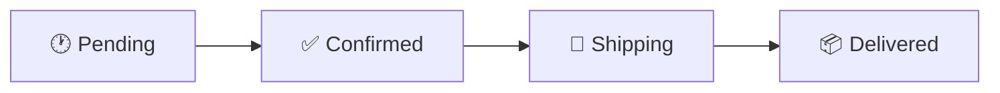
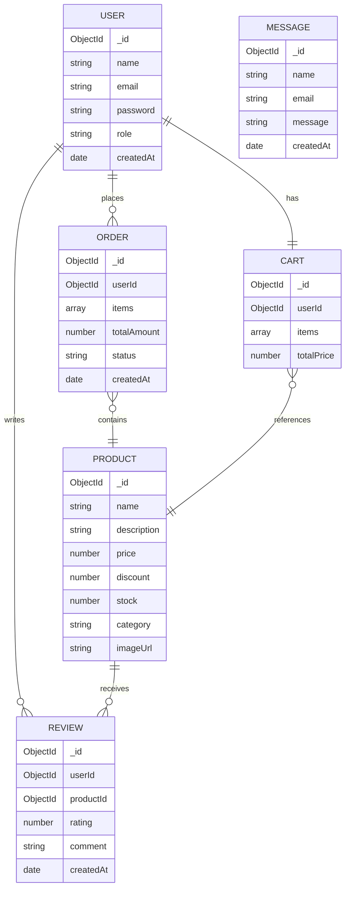

# 🛒 MERN E-Commerce Platform

A full-stack, production-ready **E-Commerce Platform** built with the **MERN Stack** — featuring a complete shopping experience, a powerful admin dashboard, and an **AI-powered chatbot** built with LangChain.js and Cohere AI.

🔗 **Live Demo:** [mern-ecomerce-4.onrender.com](https://mern-ecomerce-4.onrender.com)  
🔗 **GitHub:** [biplab-430/MERN-Ecomerce](https://github.com/biplab-430/MERN-Ecomerce)

---

## 📌 Table of Contents

- [Architecture Overview](#architecture-overview)
- [Features](#features)
- [AI Chatbot Flow](#ai-chatbot-flow)
- [Tech Stack](#tech-stack)
- [Database Schema](#database-schema)
- [API Endpoints](#api-endpoints)
- [Getting Started](#getting-started)
- [Environment Variables](#environment-variables)

---

## 🏗️ Architecture Overview

This project follows a **Monolithic Architecture** — all modules live within a single deployable Node.js/Express server communicating with a single MongoDB database.



---

## ✅ Features

### 🛍️ Shopping View
- **Home Page** — featured products, banners, categories
- **Product Listing** — browse all products with filters
- **Product Details Dialog** — full product info with add to cart
- **Cart** — add, update quantity, remove items
- **Checkout** — complete order placement flow
- **Search Page** — search products by name or category
- **Review System** — users can leave ratings and reviews
- **Account Page** — manage profile and view order history
- **Contact Us Page** — send messages to admin

### 🤖 AI Chatbot (LangChain.js + Cohere AI)
- Built-in **Help Chatbot** powered by **LangChain.js** and **Cohere AI**
- Answers product queries, order questions, and support requests
- Integrated directly into the shopping view UI
- Context-aware responses using LangChain prompt chaining

### 🔐 Authentication
- Secure **Sign Up & Sign In** with JWT authentication
- Password hashing with **bcrypt**
- Role-based access — **Admin** vs **User**
- Protected routes on both frontend and backend

### 🛠️ Admin Dashboard
- **Products Management** — create, edit, delete products; update prices and discounts
- **Orders Management** — view all orders; update order status:
  - 🕐 Pending → ✅ Confirmed → 🚚 Shipping → 📦 Delivered
- **Users Management** — view all registered users; delete users
- **Messages** — view all customer contact form submissions
- **Admin Header + Sidebar** — clean navigation layout

---

## 🤖 AI Chatbot Flow



---

## 🔄 Order Status Flow



> Admin can update order status at any stage from the dashboard.

---

## 🧰 Tech Stack

| Layer | Technology |
|---|---|
| Frontend | React.js, ShadCN UI, Lucide React, Tailwind CSS |
| Backend | Node.js, Express.js |
| Database | MongoDB, Mongoose ODM |
| Auth | JWT, bcrypt |
| AI Chatbot | LangChain.js, Cohere AI |
| Architecture | Monolithic, MVC Pattern |
| API Style | RESTful APIs |
| Deployment | Render |

---

## 🗄️ Database Schema



---

## 📡 API Endpoints

### Auth — `/api/auth`
| Method | Endpoint | Description | Auth |
|---|---|---|---|
| POST | `/register` | Register new user | ❌ |
| POST | `/login` | Login + JWT | ❌ |
| GET | `/me` | Get current user | ✅ |

### Products — `/api/products`
| Method | Endpoint | Description | Auth |
|---|---|---|---|
| GET | `/` | Get all products | ❌ |
| GET | `/:id` | Get product details | ❌ |
| POST | `/` | Create product | ✅ Admin |
| PUT | `/:id` | Update product / price / discount | ✅ Admin |
| DELETE | `/:id` | Delete product | ✅ Admin |

### Orders — `/api/orders`
| Method | Endpoint | Description | Auth |
|---|---|---|---|
| POST | `/` | Place new order | ✅ |
| GET | `/my-orders` | Get user orders | ✅ |
| GET | `/` | Get all orders | ✅ Admin |
| PUT | `/:id/status` | Update order status | ✅ Admin |

### Users — `/api/users`
| Method | Endpoint | Description | Auth |
|---|---|---|---|
| GET | `/` | Get all users | ✅ Admin |
| DELETE | `/:id` | Delete user | ✅ Admin |

### Cart — `/api/cart`
| Method | Endpoint | Description | Auth |
|---|---|---|---|
| GET | `/` | Get user cart | ✅ |
| POST | `/add` | Add to cart | ✅ |
| PUT | `/update` | Update quantity | ✅ |
| DELETE | `/remove/:id` | Remove item | ✅ |

### Reviews — `/api/reviews`
| Method | Endpoint | Description | Auth |
|---|---|---|---|
| POST | `/:productId` | Add review | ✅ |
| GET | `/:productId` | Get product reviews | ❌ |

### Chat — `/api/chat`
| Method | Endpoint | Description | Auth |
|---|---|---|---|
| POST | `/` | Send message to AI chatbot | ✅ |

### Contact — `/api/contact`
| Method | Endpoint | Description | Auth |
|---|---|---|---|
| POST | `/` | Submit contact message | ❌ |
| GET | `/` | View all messages | ✅ Admin |

---

## 🚀 Getting Started

### Prerequisites
- Node.js v18+
- MongoDB Atlas account
- Cohere AI API key

### Clone & Install

```bash
git clone https://github.com/biplab-430/MERN-Ecomerce.git
cd MERN-Ecomerce

# Install backend dependencies
cd server
npm install

# Install frontend dependencies
cd ../client
npm install
```

### Run the App

```bash
# Backend (from /server)
npm run dev

# Frontend (from /client)
npm start
```

---

## 🔑 Environment Variables

Create `.env` in `/server`:

```env
PORT=5000
MONGO_URI=your_mongodb_connection_string
JWT_SECRET=your_jwt_secret
JWT_EXPIRES_IN=7d
COHERE_API_KEY=your_cohere_api_key
NODE_ENV=development
```

---

## 💡 Why Monolithic Architecture?

| Factor | Monolith (This Project) | Microservices |
|---|---|---|
| Complexity | Low — single deployable unit | High — multiple services |
| Development Speed | Fast | Slower (infra overhead) |
| Debugging | Easy — single log stream | Harder — distributed tracing |
| Best For | Full-featured SaaS apps | Large-scale distributed systems |
| Deployment | Single Render instance | Multiple containers |

---

## 👨‍💻 Author

**Biplab Ghosh**  
B.E. Information Technology | University Institute of Technology, Burdwan  
📧 biplabg966@gmail.com  
🔗 [LinkedIn](https://linkedin.com/in/biplab-ghosh-71132a287) | [GitHub](https://github.com/biplab-430)
