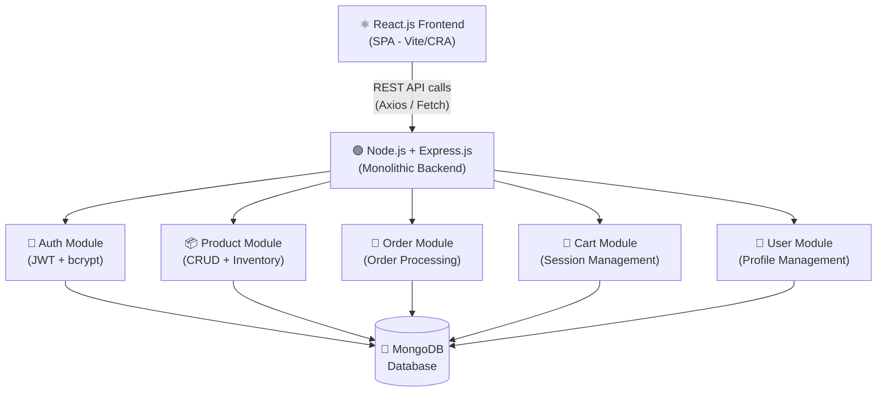
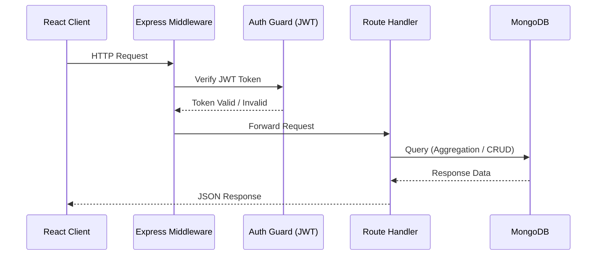
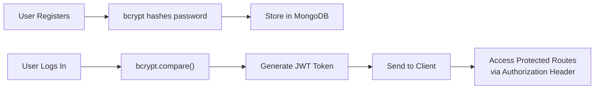
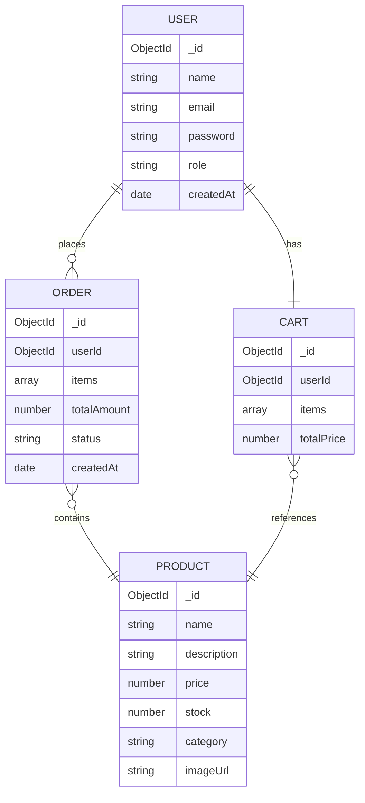

# 🛒 MERN E-Commerce Platform

A production-ready, full-stack e-commerce application built with the **MERN Stack** following a **Monolithic Architecture**. Designed with clean MVC structure, secure authentication, and optimized database queries.

🔗 **Live Demo:** [mern-ecomerce-4.onrender.com](https://mern-ecomerce-4.onrender.com)

---

## 📌 Table of Contents

- [Architecture Overview](#architecture-overview)
- [System Design](#system-design)
- [Features](#features)
- [Tech Stack](#tech-stack)
- [API Endpoints](#api-endpoints)
- [Database Schema](#database-schema)
- [Getting Started](#getting-started)
- [Environment Variables](#environment-variables)

---

## 🏗️ Architecture Overview

This project follows a **Monolithic Architecture** — all modules (auth, products, orders, cart) live within a single deployable Node.js/Express server, communicating internally via function calls rather than network requests.

> This is intentional for a project of this scope. Monoliths are simpler to develop, test, and deploy — and are the foundation before scaling to microservices.



---

## 🔄 System Design

### Request-Response Flow



### Authentication Flow



---

## ✅ Features

### 👤 User
- Secure registration & login with **JWT authentication**
- Password hashing using **bcrypt**
- Role-based access (Admin / User)

### 📦 Product
- Dynamic product listings with filters & search
- Inventory management (stock tracking)
- Admin: Create, Update, Delete products

### 🛒 Cart & Orders
- Add to cart, update quantity, remove items
- End-to-end order processing workflow
- Order history per user

### 🔧 Admin
- Inventory control dashboard
- Manage all orders and update status
- User management

---

## 🧰 Tech Stack

| Layer | Technology |
|---|---|
| Frontend | React.js, Tailwind CSS / Bootstrap |
| Backend | Node.js, Express.js |
| Database | MongoDB, Mongoose ODM |
| Auth | JWT (jsonwebtoken), bcrypt |
| Architecture | Monolithic, MVC Pattern |
| API Style | RESTful APIs |
| Deployment | Render |

---

## 📡 API Endpoints

### Auth Routes — `/api/auth`
| Method | Endpoint | Description | Auth Required |
|---|---|---|---|
| POST | `/register` | Register new user | ❌ |
| POST | `/login` | Login & get JWT | ❌ |
| GET | `/me` | Get current user | ✅ |

### Product Routes — `/api/products`
| Method | Endpoint | Description | Auth Required |
|---|---|---|---|
| GET | `/` | Get all products | ❌ |
| GET | `/:id` | Get single product | ❌ |
| POST | `/` | Create product | ✅ Admin |
| PUT | `/:id` | Update product | ✅ Admin |
| DELETE | `/:id` | Delete product | ✅ Admin |

### Order Routes — `/api/orders`
| Method | Endpoint | Description | Auth Required |
|---|---|---|---|
| POST | `/` | Create new order | ✅ |
| GET | `/my-orders` | Get user orders | ✅ |
| GET | `/` | Get all orders | ✅ Admin |
| PUT | `/:id/status` | Update order status | ✅ Admin |

### Cart Routes — `/api/cart`
| Method | Endpoint | Description | Auth Required |
|---|---|---|---|
| GET | `/` | Get user cart | ✅ |
| POST | `/add` | Add item to cart | ✅ |
| PUT | `/update` | Update cart item | ✅ |
| DELETE | `/remove/:id` | Remove cart item | ✅ |

> Total: **15+ RESTful API endpoints** covering user management, inventory control, and payment workflows.

---

## 🗄️ Database Schema



---

## 🚀 Getting Started

### Prerequisites
- Node.js v18+
- MongoDB Atlas account or local MongoDB
- npm or yarn

### Clone & Install

```bash
# Clone the repository
git clone https://github.com/biplab-430/MERN-Ecomerce.git
cd MERN-Ecomerce

# Install backend dependencies
cd server
npm install

# Install frontend dependencies
cd ../client
npm install
```

### Run the App

```bash
# Run backend (from /server)
npm run dev

# Run frontend (from /client)
npm start
```

---

## 🔑 Environment Variables

Create a `.env` file in the `/server` directory:

```env
PORT=5000
MONGO_URI=your_mongodb_connection_string
JWT_SECRET=your_jwt_secret_key
JWT_EXPIRES_IN=7d
NODE_ENV=development
```

---

## 💡 Why Monolithic Architecture?

This project deliberately uses a **Monolithic Architecture** for the following reasons:

| Factor | Monolith (This Project) | Microservices |
|---|---|---|
| Complexity | Low — single deployable unit | High — multiple services |
| Development Speed | Fast | Slower (infra overhead) |
| Best For | Small-medium apps | Large-scale distributed systems |
| Debugging | Easier — single log stream | Harder — distributed tracing needed |
| Deployment | Single Render instance | Multiple containers / Kubernetes |

> I have also built a separate **Job Portal project** using Microservices + Kafka + Redis to understand the contrast and tradeoffs at scale.

---

## 👨‍💻 Author

**Biplab Ghosh**  
B.E. Information Technology | University Institute of Technology, Burdwan  
📧 biplabg966@gmail.com  
🔗 [LinkedIn](https://linkedin.com/in/biplab-ghosh-71132a287) | [GitHub](https://github.com/biplab-430)
